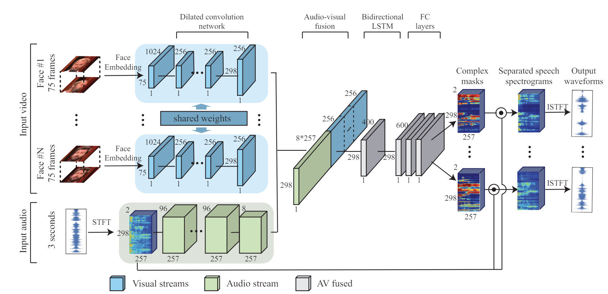
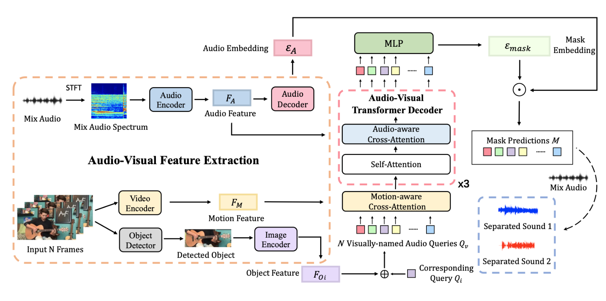
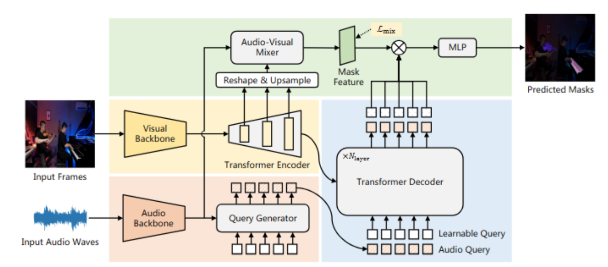
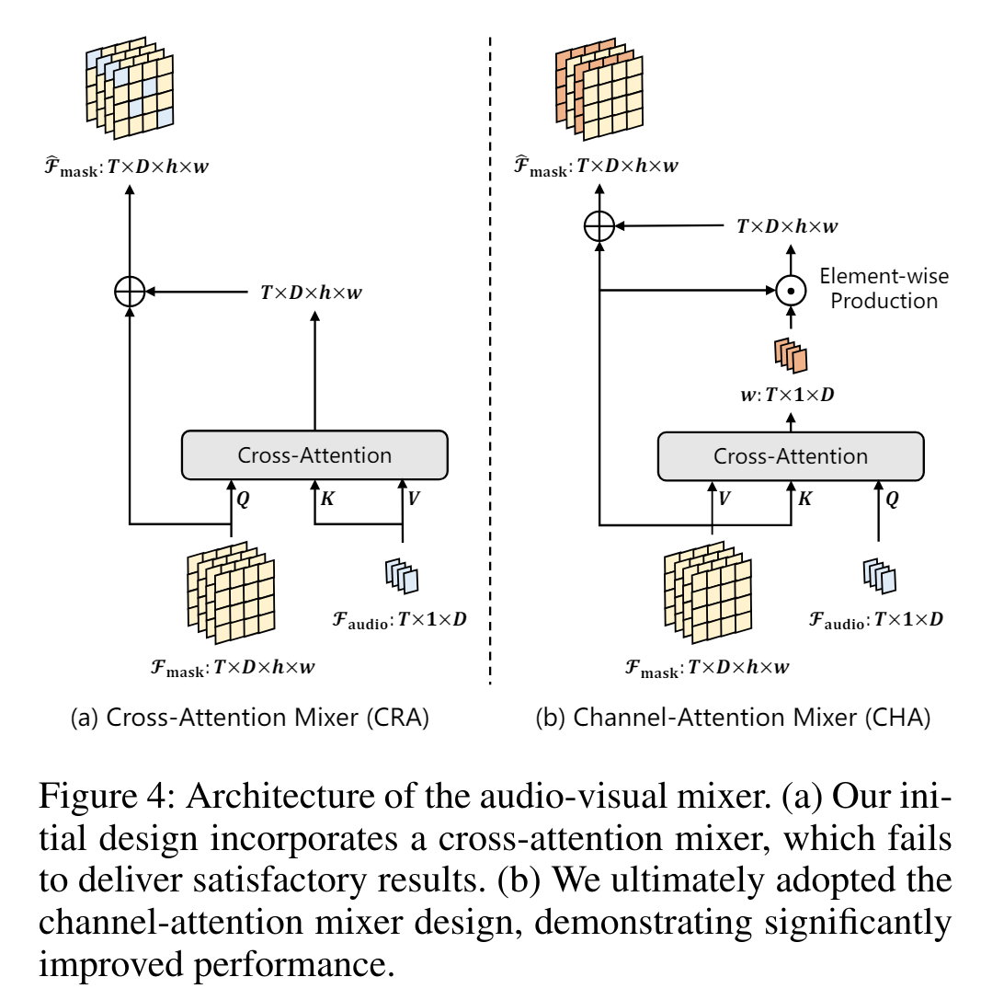
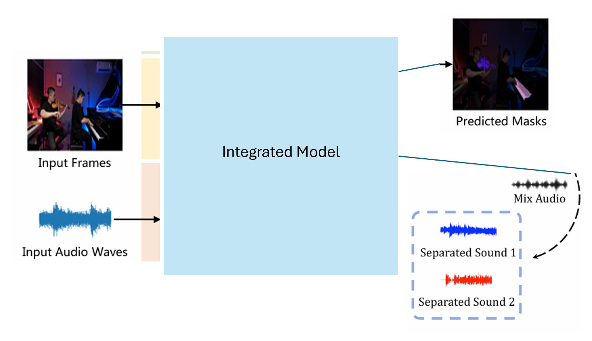

# Example Proposal

## IQuery

- Cross Attention:
    - Looking To Listen
        In looking_to_listen, the image and audio features were simply concatenated. Transformer was published at 2017, and looking_to_listen was at 2018. It is just natural that the attention mechanism was not integrated.
    - IQuery
        As time went by, there were many attempts to apply the attention mechanism to tensors with different dimensions. In IQuery, the 3 dimension image features and 1 dimension audio features were correlated using CrossAttention.

- Learnable Query:
    Query in the traditional attention mechanism was just an output from a layer. It is a learnable weights in IQuery that are added to the image features to generate the input query to the CrossAttention.

- Inputs
    - Looking To Listen
        Facial images only
    - IQuery
        They trained the model to extract the sound of instrument as the base line.
        They expanded the scope to the general events(supervised by labeled event names).
    - About Class in IQuery
        The classes are Guitar, Bass, Piano and so on. For general events, it can be sounds of animal, arguing and whatever.
        IQuery was designed to function without the class information, but in the architecture, the class index is required as an input.
        If we don't know how to make classes, we can pass the constant class index, and IQuery will still work, and we can add our own classes later whenever we want.
    - Our Class Scenario
        Class information is just a hint. It can be some categories of people, or the topic of the video meeting




**Fig. Looking To Listen Architecture**



**Fig. IQuery Architecture**

## AVSegFormer

AVSegFormer is an image segmentation model unlike the models above.
It is still worth studying because it improved the generation of the learnable Query and the CrossAttention mechanism.



**Fig. AVSegFormer Architecture**

- Query Generator
    In IQuery, the Query was simply initialized as an embedding layer.
    In AVSegFormer, the Query is generated using the AudioFeatures with multi layers of self and cross attentions.

```python
class AttentionLayer(nn.Module):
    def __init__(self, embed_dim, num_heads, hidden_dim) -> None:
        super().__init__()
        self.self_attn = nn.MultiheadAttention(
            embed_dim, num_heads, bias=False, batch_first=True)
        self.cross_attn = nn.MultiheadAttention(
            embed_dim, num_heads, bias=False, batch_first=True)
        ...

    def forward(self, query, audio_feat):
        out1 = self.self_attn(query, query, query)[0]
        query = self.norm1(query+out1)
        out2 = self.cross_attn(query, audio_feat, audio_feat)[0]
        ...
        return query
```

- CrossAttentionMixer
    The trained Query is passed to another transformer called CrossAttentionMixer.
    They claim that the channel-attention mixer design improved the performance further.




**Fig. CrossAttentionMixer**

- Adaptation
    The improved learnable Query seems to be able to replace the one in IQuery.

## Integration

While the prediction targets of IQuery and AVSegFormer are different, they share a very similar architecture in their core.

Therefore, we can generate a multitask model.

- Example Scenario
    - Inputs : Frames + Mixed Voices
    - Task1
        - Label
            Segmentation of the target speaker (Only face or the whole body).
    - Task2
        - Label
            The clean audio of the target speaker.
    - Task3 (Multi-Tasks)
        - Label 1
            Segmentation from Mixed Frames : Mix two or more image objects in one frames.
        - Label 2
            Separated Voices in indexes: The segmentation should be labeled with those indexes.



**Fig. Integration**
